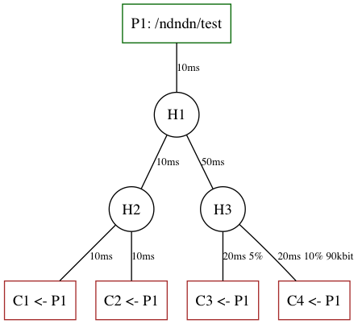

# ndndn 
♬♪   ᕕ(⌐■_■)ᕗ    ♪♬

`ndndn` (NDN Docker Net) is a set of tools and Docker images aimed at easing the process of testing NDN software as close to the real hardware as possible. 

`ndndn` utilizes [Docker Compose](https://docs.docker.com/compose/) tool - a tool for defining and running multi-container applications. For NDN developers, it allows to quickly deploy a network topology defined graphically in a `.dot` and run it using multiple Docker containers.

Running an experiment using `ndndn` is a three-step process:
* First, one prepares a `.dot` file describing experiment topology and a folder with `Dockerfile` and supporting files for the Docker image of an application being tested. 
* Then, `ndndn generate` is used to generate an experiment folder with `docker-compose.yml` configuration file which describes experiment setup in “Docker compose” terms.
* Finally, `ndndn run` is used to run the experiment.



A `.dot` file describes network topology graph a user wish to run, by defining three types of nodes (**h**ub, **p**roducer, **c**onsumer), links between these nodes and links’ properties (_latency, loss, bandwidth_). Each node of the topology graph will eventually become a Docker container when running experiment. These containers are based off of Docker images defined by `Dockerfile`s prepared during first step. There are no limits on how many containers one can run, though there is a limit (right now) on how many network-shaped links each node can have (no more than 7 right now). 

> If you are rich in hardware resources or financially, you may be interested in setting up [Docker swarm](https://docs.docker.com/engine/swarm/) in order to run very serious experiments with tens of containers. There was a time, I’ve tried swarming on Amazon EC2 instances, it was exciting.  
>   
>  ( ͡° ͜ʖ ͡°)ﾉ⌐■-■  

## build ( ´◔ ω◔`) ノシ
* macOS:

```
brew install multitail libgraphviz-dev graphviz
```

* ubuntu:

```
sudo apt-get install -y multitail libgraphviz-dev graphviz
```

* platform-independent:

```
cd ndndn
pip install pypandoc virtualenv
virtualenv env && source env/bin/activate
pip install .
```

# examples ᕕ( ᐛ )ᕗ
## ndnping (☞ﾟ∀ﾟ)☞

The simplest and quickiest (in terms of Docker image build times) example would be `ndnping` example. For the topology shown above:

```
ndndn generate -t topologies/bintree4.dot \
               -a hub \
               -c examples/ping/consumer.env \
               -p examples/ping/producer.env \
               -o ping-bintree4
```

Here's what happened:
* `-t` passed topology file;
* `-a` passed path to application description folder; since we are running ndnping and it's included in hub image, we provide path to hub description here;
* `-c` provides consumer environment file; [examples/ping/consumer.env](examples/ping/consumer.env) defines just one variable - `ENTRYPOINT` which is a ndnping client command;
* `-p` provides producer environment file; [examples/ping/producer.env](examples/ping/producer.env) defines `ENTRYPOINT` for ndnpingserver app;
* `-o` tells `ndndn` to write generated setup into directotry called `ping-bintree4`.

You can examine the contents of `ping-bintree4` folder: it has `docked-compose.yml` configuration file, `topology.pdf` of the topology being tested and symlinks to hub, producer and consumer image description folders.

```
cd ping-bintree4 && ndndn run .
```

Will launch `docker-compose` in `ping-bintree4` folder. According to the bintree4 topology, this will create 8 containers: *p1, h1, h2, h3, c1, c2, c3, c4* and run them.

You can examine results being generated for each of the container in `generated` folder. To see ndnping output in real-time, run this:

```
multitail -s 4 generated/c*/entrypoint.log
```

To stop experiment, type:

```
docker-compose down
```

## ndnrtc (⌐■_■)

> **!!!** building ndnrtc image will take some time and space.

This is a quick example of how one can run [ndnrtc-client](https://github.com/remap/ndnrtc/tree/master/cpp/client) application on bintree4 topology (shown above) and collect results from this experiment:

```
ndndn generate -t topologies/bintree4.dot \
               -a examples/ndnrtc/ \
               -c examples/ndnrtc/consumer.env \
               -p examples/ndnrtc/producer.env \
               -o ndnrtc-bintree4
cd ndnrtc-bintree4 && ndndn run .
sleep 30 # run for 30 seconds
docker-compose down
```

Generated files can be found in `ndnrtc-bintree4/generated` folder after experiment.

*TBD: add post-processing step for ndnrtc results to make it visual and easy to digest*

# use ndndn  ƪ(ړײ)‎ƪ​​

This is a general description of how one should use `ndndn`.

* **Prepare app description**

  * app description is a folder that contains `Dockerfile` and supporting files for your application Docker image;
  * see more [here](#creating-app-image--‿-) on what  to consider when creating an app image;
  * it is implied that your app can work in consumer/producer mode OR that you provide two executables in your app Docker image;
  * environment variables files `consumer.env` and `producer.env` should be used in order to define app's behavior as either consumer or producer.

* **Generate experiment**

```
ndndn generate --topology=topology.dot \
               --app=`pwd`/app \
               --consumer-env=`pwd`/app/consumer.env \
               --producer-env=`pwd`/app/producer.env
```

  the command above will generate a folder (most likely called `experiment1`) with the following:

   * `docker-compose.yml` — Docker Compose yml file describing your setup
   * `topology.pdf`
   * `h` — symlink or folder to the `hub` folder
   * `c` — symlink or folder to the `app` folder
   * `p` — symlink or folder to the `app` folder
    
> whether it is a symlink or folder - can be altered by passing option `--copy` to `ndn generate` command.

* **Run experiment**

  * change to the newly generated folder and type:
  
```
ndndn run .
```

> `ndndn run` is just a wrapper around `docker-compose up -d —build` command.  
> It has not been tested against different versions of docker-compose vs docker, so if you get any errors, please report an issue or contact author.  

## collecting results ᕙ(`▽´)ᕗ

By default, docker will mount `/generated` folder from each container into a separate subfolder under `generated` folder on the host machine (like, `generated/p1`, `generated/c1`, `generated/c2` and so on). If you want to collect any results from your nodes, you should have your image configured to write to files in this directory.

## creating app image ☉ ‿ ⚆

Few things should be considered when creating an app image:

* create a separate folder for app description - put `Dockerfile` and all supporting files in it;
* app image **must** be derived from [`peetonn/ndn-docker:ndndn-hub`](https://hub.docker.com/r/peetonn/ndn-docker/tags/) image: it provides neccessary bootstrapping scripts and environment for launching apps. This means your `Dockerfile` should start with:
	```
	FROM peetonn/ndn-docker:ndndn-hub
	```
* container entry point must be defined through `ENTRYPOINT` environmental variable:
	```
	ENV ENTRYPOINT=<path to your executable>
	```
* run-time envrionment can be configured using `.env` files for consumer and producer separately - for that, use `-c` and `-p` arguments for `ndndn generate`;

* use `-a` argument with path to the app image description folder for `ndndn generate`.

> See [ndnrtc](examples/ndnrtc) image for an example of how app image can be configured.

## hub image (◕ᴥ◕ʋ)

[Hub image](hub) is used by `ndndn generate` by default (can be altered by providing `-h` argument). It contains latest `NFD` version (defined by [`peetonn/ndn-docker:latest`](https://hub.docker.com/r/peetonn/ndn-docker/tags/) image), [ndntools](https://github.com/named-data/ndn-tools), additional assisting tools (like network shaping `tc`) and bootstrapping script [`bootstrap.sh`](hub/bootstrap.sh).

Bootrapping performs these functions:

* starts NFD;
* registers prefixes towards other containers (defined by `REGISTER` variable created by `ndndn generate`);
* applies network-shaping to each link (defined by `NETWORK_SHAPE` variable created by `ndndn generate`);
* executes `ENTRYPOINT` variable and redirects its' output into `/generated/entrypoint.log`;
* if `ENTRYPOINT` is empty and `NFD_BACKGROUND==no` then runs NFD in foreground.

# describing topologies (҂◡_◡) ᕤ

*TBD*
